<div align="center">

# 🐾 FurEver Home

### *Helping pets find their forever homes*

[](https://flutter.dev)
[](https://dart.dev)
[](https://firebase.google.com)
[](LICENSE)
[](https://flutter.dev/multi-platform)

**FurEver Home** is a full-stack Flutter pet adoption app that connects loving families with animals in need of homes. Built with Firebase for real-time data, Gemini AI for smart assistance, and a clean modern UI — it's a complete adoption ecosystem in your pocket.

[🌐 Live Demo](https://furever-home-19609.web.app) · [📱 Screenshots](#-screenshots) · [🚀 Getting Started](#-getting-started)

</div>

---

## ✨ Features

| Feature | Description |
|---|---|
| 🐕 **Browse & Adopt** | Explore adoptable dogs, cats, birds, and more with rich profiles |
| 🔍 **Smart Search** | Voice search and location-based filtering to find your perfect match |
| 📸 **Community Feed** | Share pet stories and photos in a real-time Firebase-powered community |
| 🔊 **Know the Sound** | Interactive audio game to identify animal sounds |
| 💰 **Donate & Volunteer** | Find ways to support shelters — donate money or volunteer your time |
| 🤖 **AI Chat (Gemini)** | Get instant pet care answers from an integrated Gemini AI assistant |
| 🔐 **Firebase Auth** | Secure email/password sign-up and login |
| 👤 **User Profile** | Custom avatar, dark mode, and password management |
| 🌙 **Dark Mode** | Full light/dark theme support with persistent preference |
| 📱 **Cross-Platform** | Runs on Android, iOS, and Web |

---

## 📸 Screenshots

<div align="center">

| Onboarding | Login | Home |
|---|---|---|
| 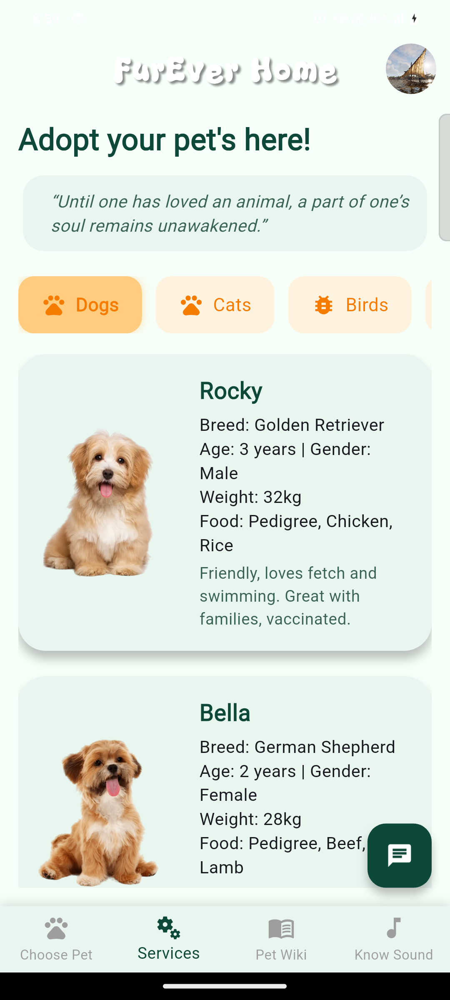 | 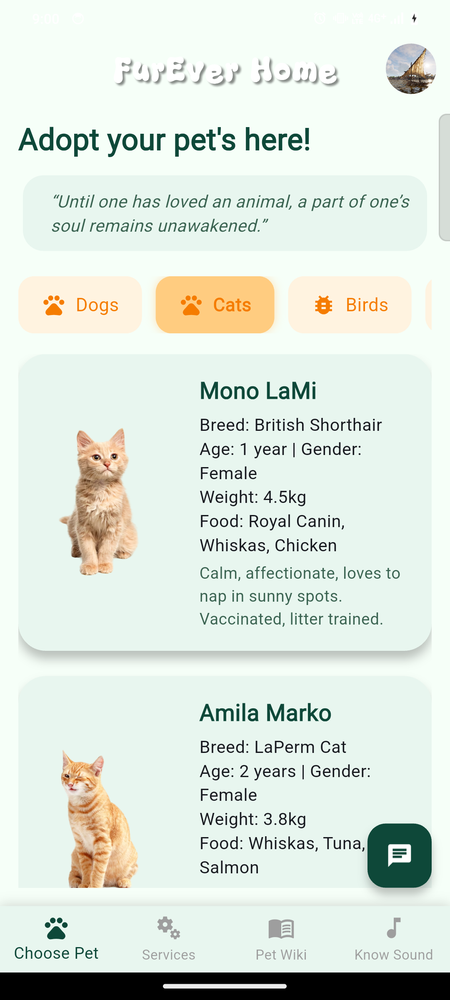 | 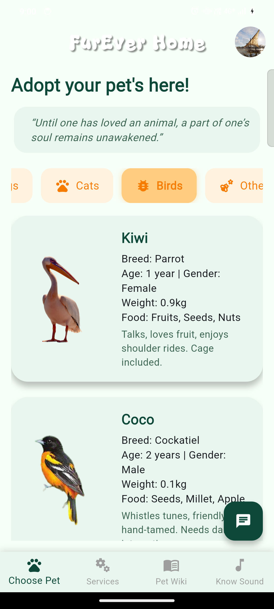 |

| Pet Categories | Pet List | Adopt Pet |
|---|---|---|
| 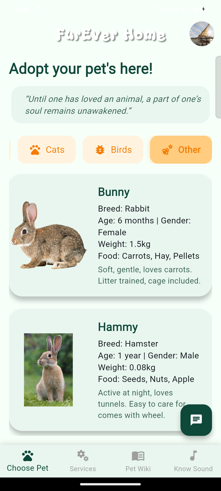 | 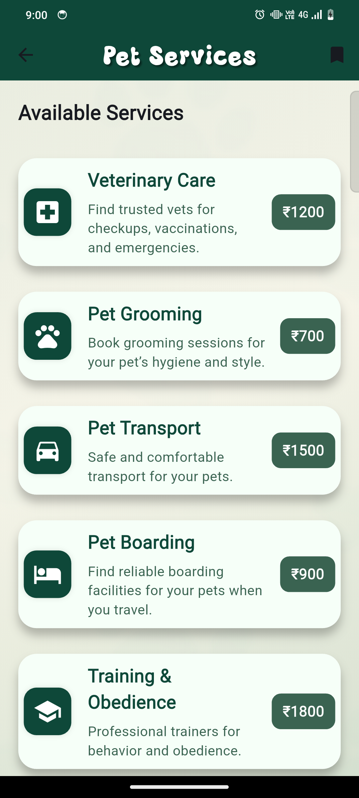 | 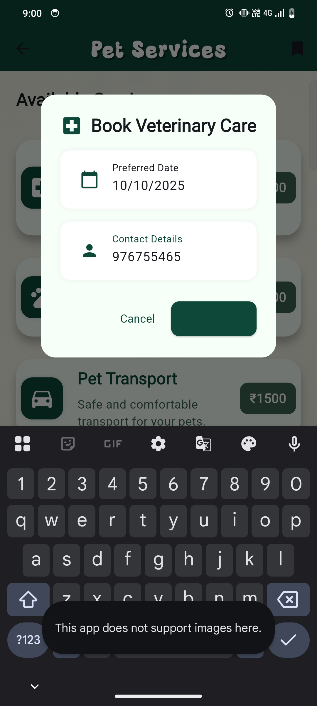 |

| Community Feed | Pet Wiki | Know the Sound |
|---|---|---|
| 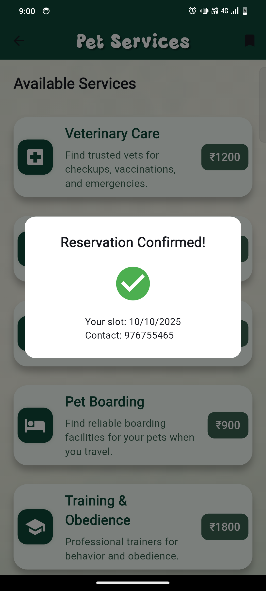 | 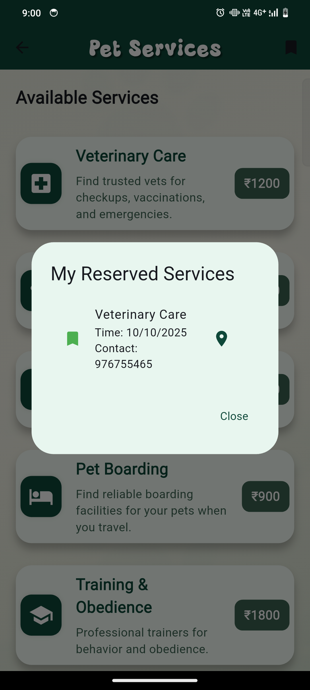 | 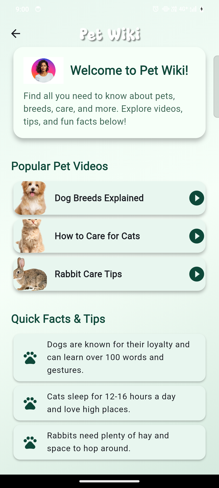 |

| Donate & Volunteer | AI Chat | User Profile |
|---|---|---|
| 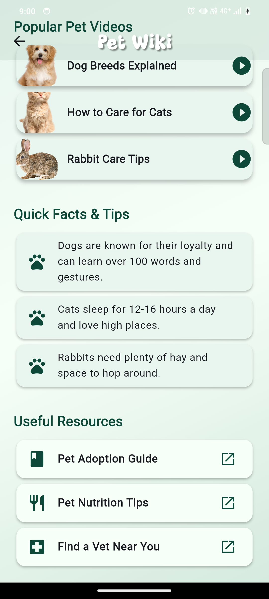 | 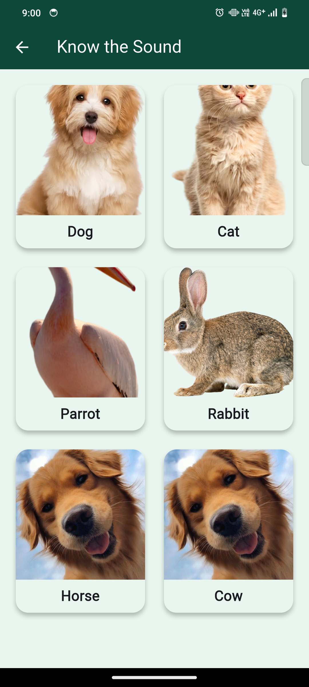 | 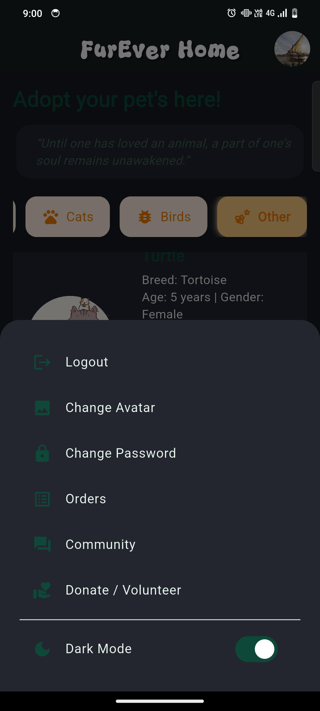 |

</div>

---

## 🛠️ Tech Stack

| Layer | Technology |
|---|---|
| **Framework** | Flutter 3.x |
| **Language** | Dart 3.x |
| **Authentication** | Firebase Auth |
| **Database** | Cloud Firestore |
| **Storage** | Firebase Storage |
| **AI** | Google Gemini API |
| **Voice** | speech_to_text |
| **Fonts** | Google Fonts (Poppins) |
| **State** | setState (built-in) |
| **Version Control** | Git & GitHub |

---

## 🏗️ Project Structure

```
lib/
├── main.dart                    # App entry point, theme setup
├── get_started.dart             # Onboarding / landing screen
├── login_page.dart              # Firebase Auth login
├── signup.dart                  # User registration flow
├── choose_pet.dart              # Home dashboard & category selection
├── home_page.dart               # Pet browsing with voice search
├── adopt_pet_page.dart          # Pet detail & adoption request
├── pet_adoption_confirmation.dart
├── community_feed_page.dart     # Real-time social feed (Firestore)
├── pet_wiki_page.dart           # Pet encyclopedia
├── know_the_sound_page.dart     # Interactive audio quiz
├── donate_volunteer_page.dart   # Donation & volunteering
├── services_page.dart           # Pet services directory
├── gemini_chat_sheet.dart       # Gemini AI chat assistant
├── my_profile_page.dart         # User profile & settings
├── image_upload_service.dart    # Firebase Storage upload helper
└── firebase_options.dart        # Auto-generated Firebase config
```

---

## 🚀 Getting Started

### Prerequisites

- [Flutter SDK](https://flutter.dev/docs/get-started/install) (≥ 3.4.3)
- [Firebase CLI](https://firebase.google.com/docs/cli) (`npm install -g firebase-tools`)
- A code editor: VS Code or Android Studio
- A Google account for Firebase

### Installation

**1. Clone the repository**
```sh
git clone https://github.com/NISHANTH-KONCHADA/fureverhome.git
cd fureverhome
```

**2. Install Flutter dependencies**
```sh
flutter pub get
```

**3. Set up Firebase**

This repo includes `firebase_options.dart` so you can run the app with the existing Firebase project. If you want to connect your own Firebase backend:
```sh
# Install FlutterFire CLI
dart pub global activate flutterfire_cli

# Configure your own Firebase project
flutterfire configure
```

**4. Add your Gemini API key**

Create a `.env` file in the project root:
```env
GEMINI_API_KEY=your_api_key_here
```
> The `.env` file is listed in `.gitignore` — your key will never be committed.

**5. Run the app**
```sh
# Mobile (Android/iOS)
flutter run

# Web browser
flutter run -d chrome

# Specific device
flutter devices          # list available devices
flutter run -d <device>
```

---

## 🌐 Web Deployment (Firebase Hosting)

```sh
# Build the web release
flutter build web --release

# Deploy to Firebase Hosting
firebase deploy --only hosting
```

The live app will be available at: **https://furever-home-19609.web.app**

---

## 🧪 How to Test the App

### Run on Chrome (Web)
```sh
flutter run -d chrome
```

### Run on Android Emulator
```sh
# Start emulator from Android Studio, then:
flutter run
```

### Analyze for errors
```sh
flutter analyze
```

### Check for dependency issues
```sh
flutter pub get
flutter pub outdated
```

---

## 📋 Key Flows to Test

| Flow | How to Test |
|---|---|
| **Sign Up** | Tap "Get Started" → "Sign Up" → fill form |
| **Login** | Enter email/password created above |
| **Browse Pets** | Select a category → scroll pet list → tap a pet |
| **Adopt** | On pet detail page → tap "Adopt" → fill form |
| **Community** | Profile menu → Community → post a photo/text |
| **AI Chat** | Orange chat FAB on any page → ask a question |
| **Know the Sound** | Bottom nav → Know Sound tab → tap animal |
| **Dark Mode** | Profile menu → toggle Dark Mode |

---

## 🤝 Contributing

1. Fork the repository
2. Create a feature branch: `git checkout -b feat/your-feature`
3. Commit your changes: `git commit -m 'feat: add your feature'`
4. Push to the branch: `git push origin feat/your-feature`
5. Open a Pull Request

---

## 👨‍💻 Author

**Nishanth Konchada**  
[](https://github.com/NISHANTH-KONCHADA)

---

## 📄 License

This project is licensed under the MIT License — see the [LICENSE](LICENSE) file for details.

---

<div align="center">
Made with ❤️ and Flutter &nbsp;|&nbsp; Give a ⭐ if you like this project!
</div>
